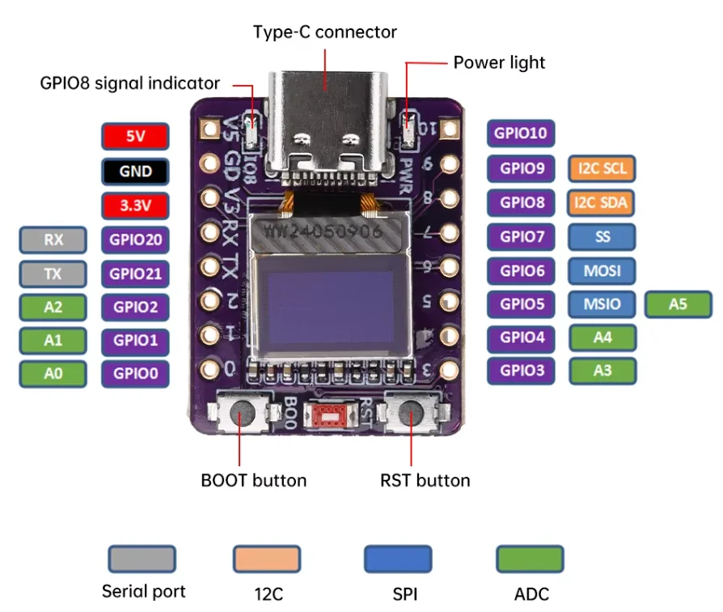

# ESP32-C3 demo

## Used Hardware ESP32-C3



### DFPlayer Mini Wiring

Current software configuration for the DFPlayer is defined in [src/dfplayer.cpp](src/dfplayer.cpp):

* ESP32-C3 GPIO4 -> DFPlayer RX
* ESP32-C3 GPIO3 <- DFPlayer TX
* ESP32-C3 GND -> DFPlayer GND
* ESP32-C3 5V -> DFPlayer VCC
* Speaker -> DFPlayer SPK_1 and SPK_2

Notes:

* OLED already uses GPIO5 and GPIO6.
* Onboard LED uses GPIO8.
* Use a common GND between ESP32-C3 and DFPlayer.
* Power the DFPlayer from 5V, not 3.3V.
* A 1 kOhm resistor between ESP32 TX and DFPlayer RX is recommended.
* Connect one speaker directly between SPK_1 and SPK_2.
* Do not connect SPK_1 or SPK_2 to GND.
* Do not use SPK_1 and SPK_2 as two separate stereo outputs.

Optional:

* Use DFPlayer DAC_R and DAC_L instead of SPK_1 and SPK_2 when connecting an external amplifier.
* BUSY is currently not connected in software.

### IR Sensor SR505 Wiring

Current software configuration for the IR sensor is defined in [src/ir_sensor.cpp](src/ir_sensor.cpp):

* ESP32-C3 GPIO2 <- SR505 OUT
* ESP32-C3 3.3V -> SR505 VCC
* ESP32-C3 GND -> SR505 GND

Notes:

* GPIO2 is configured as INPUT_PULLUP.
* Avoid GPIO0 on the ESP32-C3 SuperMini — it has an on-board 10 kΩ pull-down resistor that conflicts with INPUT_PULLUP and can cause crashes.
* The SR505 output is active-HIGH: it pulls its OUT pin HIGH when motion is detected.
* The firmware reads LOW on GPIO2 as "detected" — wire the SR505 OUT pin through an inverter (e.g. a single NPN transistor with a pull-up resistor) or adjust the polarity in [src/ir_sensor.cpp](src/ir_sensor.cpp) if the module is active-HIGH.
* Alternatively, if your SR505 module has an open-collector output, the internal pull-up on GPIO2 is sufficient and no external components are needed.
* Serial output is printed on positive edge (beam broken) and negative edge (beam clear) for debugging.

### Ultrasound Output Note

Current software uses GPIO1 for the ultrasound PWM output.

Hardware note:

* Crackling on stop was traced to unstable VCC on the connected output stage.
* Adding supply buffering close to the load or driver helps, for example a 100 nF ceramic capacitor together with a larger bulk capacitor.
* Keep GND short and common between the ESP32-C3 and the ultrasound driver stage.

### DFPlayer SD Card Layout

The current software uses the recommended numbered folder structure:

* /01/001.mp3 -> sunrise
* /01/002.mp3 -> chime
* /01/003.mp3 -> ocean
* /01/004.mp3 -> alarm
* /sound?name=stop -> stop playback

If you want to add more groups later, use folders like /02, /03, ... with numbered files inside them.

## Use PlatformIO

In VSCode see elements in the buttom left corner to transfer projekt to arduino board.

### WiFi Fallback Configuration

The firmware tries the configured WiFi networks in this order during boot.

The default credentials are read from [src/credentials.h](src/credentials.h). The current fallback order in firmware is:

* `WIFI_SSID_1`, `WIFI_PASSWORD_1`
* `WIFI_SSID_2`, `WIFI_PASSWORD_2`
* `WIFI_SSID_3`, `WIFI_PASSWORD_3`

### Sample Configuration

```cpp
#define WIFI_SSID_1 "mySSID"
#define WIFI_PASSWORD_1 "myPassword"
```
